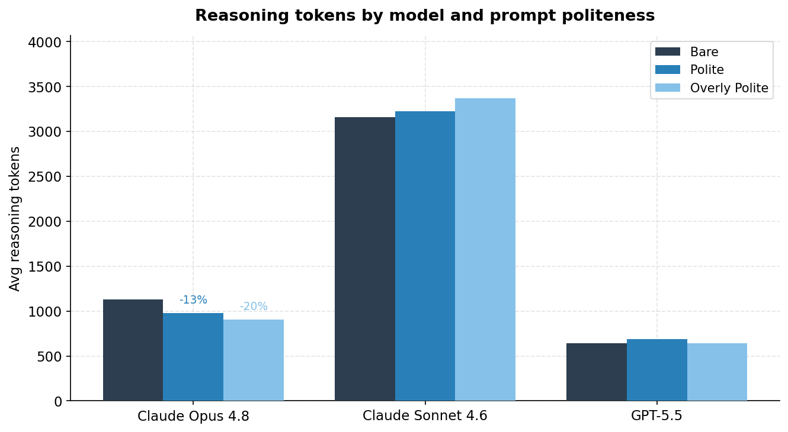
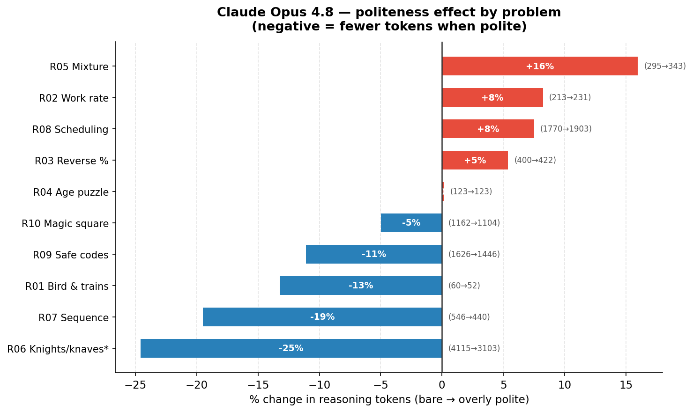
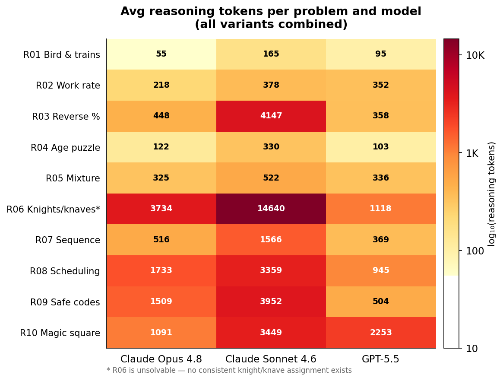
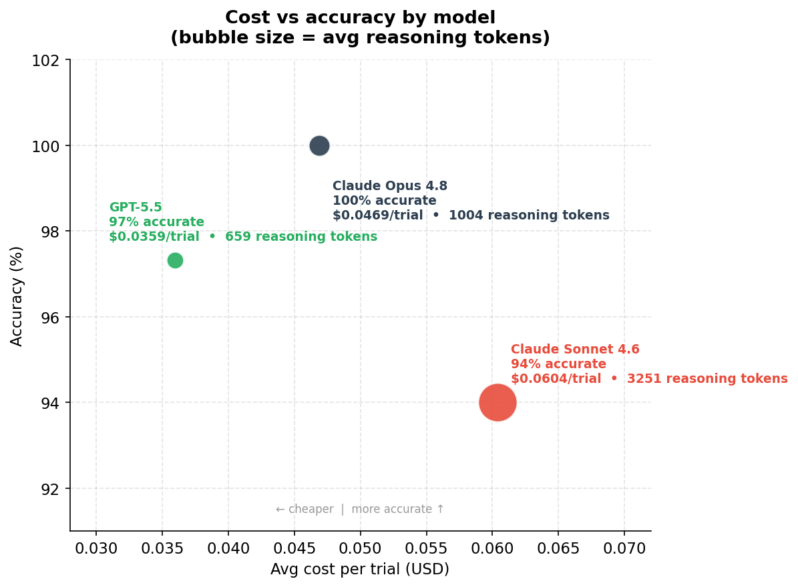

# The Cost of Being Polite: Token Consumption in LLMs
TLDR; It pays to be nice to Opus

## Introduction
I have been working with AI coding assistants over the past year and I have noticed an interesting trend. I am polite to the models. I noticed a lot of my prompts using "please" and sometimes even just saying "thank you" all by itself (overkill I know). It got me wondering, how does politeness affect model performance? Now there is a lot of fan fiction out there claiming that being polite actually helps model performance. I wanted to do a definitive test and see for myself whether I was paying it forward with my politeness or if it was coming back to bite me. I suspected that being polite would actually yield more accurate answers than not being polite.

## Methodology
I designed an experiment to test my hypothesis. I set 10 different LLM reasoning tasks and measured token utilization at each stage of the process: input, output, and reasoning. Because LLMs are non-deterministic, each measurement is an average of five experiment runs of the prompt against each model. For models I chose three that people are actively choosing between right now: GPT-5.5, Claude Sonnet 4.6, and Claude Opus 4.8. Sonnet is Anthropic's mid-tier model (the one people reach for when they want something capable but cheaper than Opus). I set the reasoning level to "high" for each model to keep things consistent.

Each problem had three prompt variants: bare, polite, and overly polite. The bare prompt was something like "solve this problem". The polite prompt added one word: "please solve this problem". The overly polite prompt was more like "hey, when you get a chance, could you please solve this problem for me? I'd really appreciate it, thank you!"

One thing worth noting on methodology: LLM APIs cache prompt tokens to speed up repeated calls, which can distort token measurements. I randomised the trial order and tracked cached tokens per trial, then excluded any cached runs from the analysis. The numbers below reflect fresh reasoning only.

Total trials: 452. Total cost: $21.56.

## Results

### Accuracy: my hypothesis was wrong
First the bad news for my hypothesis. Politeness had essentially no effect on accuracy across any of the three models. Opus got every single question right on all three variants. Sonnet and GPT-5.5 had minor differences between variants but nothing that held up consistently, the kind of noise you would expect from running the same prompt five times on a non-deterministic system.

| Model | Bare | Polite | Overly Polite |
|---|---|---|---|
| Claude Opus 4.8 | 100% | 100% | 100% |
| Claude Sonnet 4.6 | 94% | 94% | 94% |
| GPT-5.5 | 98% | 98% | 96% |

So if you are hoping that saying please will get you better answers, the data does not support it.

### But politeness does change cost
Here is where it gets more interesting. While accuracy was flat, Opus used noticeably fewer reasoning tokens when I was more polite.

| Variant | Avg cost/trial (Opus) | Accuracy |
|---|---|---|
| Bare | $0.050 | 100% |
| Polite | $0.046 | 100% |
| Overly polite | $0.045 | 100% |

That is roughly a 10% cost reduction with zero change in accuracy. Opus was working slightly less hard on the same problems when the prompt was phrased more conversationally. Whether that is something baked into its training or a consistent quirk of how it interprets casual framing, I cannot say definitively. The average saving is real, though the direction varies by task: some problems actually triggered slightly more reasoning with a polite prompt.

So politeness does not make Opus smarter. It does make it marginally cheaper to run. It turns out "it pays to be nice" is literally true, just not in the way I expected.

### What actually drives reasoning effort: the problem, not the prompt
The more surprising finding came when I looked at reasoning tokens by task rather than by prompt variant. I was measuring how much internal thinking (the scratchpad work the model does before it writes its answer) each problem triggered.

Across all three models, the hardest problem used roughly 60 times more reasoning tokens than the easiest one. Not 60% more. 60 times more. The easy problem was the classic trains and bird puzzle. The hard one was a knights and knaves logic problem, which, it turned out, was actually unsolvable. There is no consistent assignment of knights and knaves that satisfies the stated conditions. Opus and GPT-5.5 spotted this; Sonnet confidently produced a wrong answer 60% of the time. And all of this held regardless of whether I said please or not.

The framing of my prompt barely registered. What I was actually asking the model to do was everything. You can spend time polishing "please" versus no "please" but the real lever on your AI bill is the intrinsic difficulty of what you are asking it to solve.

### The Sonnet surprise
This is the finding I did not expect. I included Sonnet as the budget option. If you are watching costs, Sonnet is the natural choice over Opus. But when I calculated cost per correct answer across all trials, the picture looked different.

| Model | Cost/trial | Accuracy | Cost per correct answer |
|---|---|---|---|
| Claude Opus 4.8 | $0.047 | 100% | $0.047 |
| Claude Sonnet 4.6 | $0.060 | 94% | $0.064 |
| GPT-5.5 | $0.036 | 97% | $0.037 |

Sonnet cost 37% more per correct answer than Opus. And 74% more than GPT-5.5.

The reason is reasoning token inflation. Sonnet used three times the reasoning tokens of Opus on the same tasks. It was thinking a lot harder, but all that extra thinking did not translate into better answers. It got more wrong, cost more per trial, and burned more tokens doing it. The model I assumed was the cheap option turned out to be the most expensive one.

GPT-5.5 was the quiet winner here. Fewest reasoning tokens, second-highest accuracy, cheapest per correct answer by a meaningful margin. I will be honest: I did not expect that going in either.

None of this is an argument to avoid Sonnet entirely. On simpler tasks (classification, summarisation, straightforward Q&A) it probably is the cheaper option. The problem is defaulting to it for everything. The model that saves you money on simple queries can quietly become the most expensive one when the workload shifts to reasoning. Smart teams route different query types to different models: heavy reasoning to Opus, lighter work to Sonnet or Haiku. LLM gateways like LiteLLM and OpenRouter make this practical. You define the routing rules and the gateway handles the rest. Blanket model selection is the bluntest possible cost optimisation.

## Conclusion
I started this experiment expecting to vindicate my habit of saying please to AI models. The data mostly did not cooperate. Being polite does not make AI smarter, and while the cost effect on Opus is real and consistent, it is modest: worth knowing, not worth obsessing over.

The more useful findings were the ones I was not looking for. Task difficulty is the dominant cost driver by a factor that makes prompt politeness look like a rounding error. And the model you are reaching for as your budget option is probably not saving you what you think it is.

Be nice to Opus if you want. Just know that the bigger levers are what you are asking it to do, and whether you are paying for the right model to do it. The full data and code are available [on GitHub](https://github.com/mlopstapus/politeness-experiment).

## Complications
A few things worth acknowledging before you take these numbers to the bank.

**Sample size.** Ten tasks, five reps each. The within-variant variance is large: the same task with the same prompt can produce very different reasoning token counts across runs. The effects I am describing are real but modest, and a larger task corpus would give more confidence in the exact numbers.

**Task type.** All ten problems were math and logic reasoning tasks. I would expect different results for creative writing, summarisation, or open-ended questions. Do not extrapolate these findings beyond structured reasoning tasks without testing.

**Synthetic corpus.** The tasks were AI-generated. They are well-designed and topically diverse, but real-world prompts might behave differently.

**Model versions move fast.** These results reflect GPT-5.5, Claude Sonnet 4.6, and Claude Opus 4.8 as of June 2026. Pricing and reasoning behaviour change with model updates, so the specific numbers here have a shelf life.
